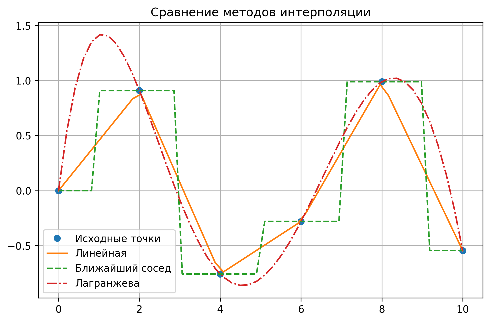

# interpolation_IITP
 Здесь будут простейшие и продвинутые алгоритмы интерполяции.

# Теоретические сведения о методах интерполяции

Начнем с простеших алгоритмов интерполяции, таких как:

1. **Линейная интерполяция**  
2. **Метод ближайшего соседа (Nearest Neighbor)**  
3. **Лагранжева интерполяция**

## 1. Линейная интерполяция
 
Линейная интерполяция рассматривает каждый промежуток между двумя соседними точками $(x_i, y_i)$ и $(x_{i+1}, y_{i+1})$ как отрезок прямой. Если нам нужно найти значение функции в некоторой точке $x$ между $x_i$ и $x_{i+1}$, то $y$ вычисляется по формуле линейного приближения:

$$
y = y_i + \frac{(x - x_i)}{(x_{i+1} - x_i)} \cdot (y_{i+1} - y_i).
$$

**Особенности и применение**
- Быстро реализуется и часто используется для грубого, но понятного приближения данных.
- Обеспечивает непрерывность функции, но **первая производная разрывна** на границах кусочных интервалов.
- Подходит для визуализации и простых расчётов.

## 2. Метод ближайшего соседа (Nearest Neighbor)

Значение функции в точке $x$ берётся равным значению функции в **ближайшей** из имеющихся точек выборки. Проще говоря, если $x$ ближе к $x_i$, чем к другим точкам $\{x_j\}$, то для $x$ берётся $y = y_i$.

**Особенности и применение**
- Простая реализация: функция получается &laquo;ступенчатой&raquo;.
- Полезен, если данные имеют дискретную природу или если важно быстрое грубое приближение.
- Абсолютно не сглаживает данные.

## 3. Лагранжева интерполяция

Лагранжева интерполяция строит **полиномиальную** функцию $L(x)$, проходящую через все заданные точки $\{(x_i, y_i)\}$. Для $n$ точек будет полином степени $n-1$. Общая формула:

$$
L(x) = \sum_{j=0}^{n-1} y_j \cdot \ell_j(x),
\quad
\text{где}
\quad
\ell_j(x) = \prod_{\substack{0 \le m \le n-1 \\ m \neq j}} 
\frac{x - x_m}{x_j - x_m}.
$$

**Особенности и применение**
- Проходит через все исходные точки: $L(x_i) = y_i$.
- Гладкая функция, однако при увеличении числа точек возможны значительные колебания между ними.
- Полезна, когда нужно получить аналитическое выражение аппроксимирующей функции.

## Сравнительная таблица методов

| Метод                     | Тип аппроксимации | Сложность реализации | Гладкость            | Применимость                                                                                     |
|---------------------------|-------------------|----------------------|----------------------|--------------------------------------------------------------------------------------------------|
| **Линейная**             | Кусочно-линейная | Низкая               | Непрерывная, но разрыв 1-й производной | Универсальное быстрое приближение, часто в графическом представлении                             |
| **Ближайший сосед**       | Ступенчатая       | Очень низкая         | Разрывная функция    | Хорош для категориальных данных, &laquo;грубого&raquo; приближения или когда требуется &laquo;ближайший выбор&raquo;      |
| **Лагранжева**           | Полиномиальная   | Средняя              | Гладкая              | Высокая точность при малом количестве точек; осторожность при большом числе точек (эффект Рунге) |

## Структура репозитория

- **`interpolation_methods.py`** — исходный код функций:
  - `linear_interpolation()`
  - `nearest_neighbor_interpolation()`
  - `lagrange_interpolation()`
  - `demo()` — функция-пример сравнения методов на тестовых данных.
- **`README.md`** — данный файл с описанием теории и инструкцией по запуску.

##  Сравнение простейших методов интерполяции
Ниже приведено изображение, показывающее результаты работы трёх методов
интерполяции (линейной, ближайшего соседа и Лагранжа) на примере функции sin(x):

